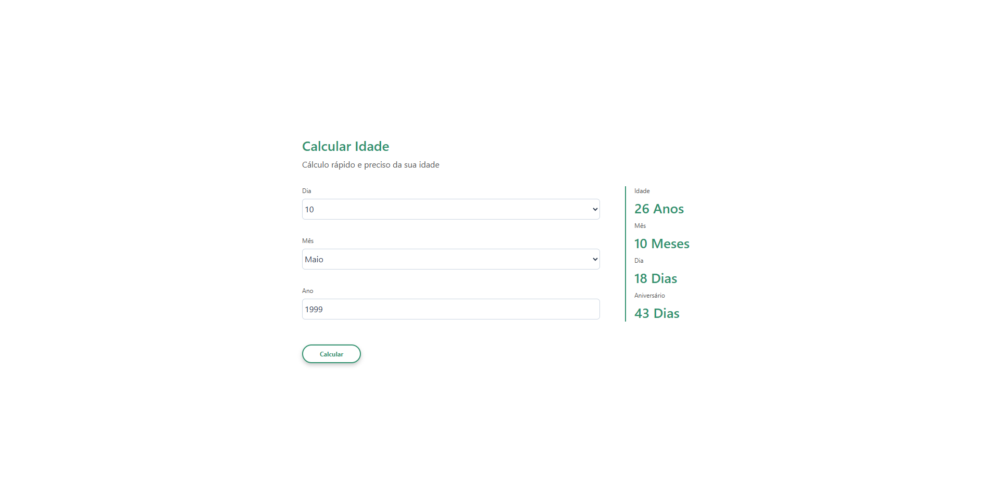
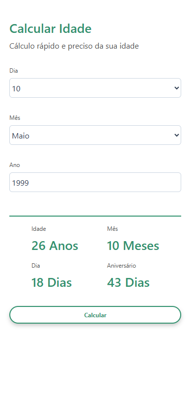

# Calculadora de Idade

Uma aplicação web que calcula a idade de uma pessoa a partir da data de nascimento informada, exibindo o resultado em anos, meses e dias — além de indicar quantos dias faltam para o próximo aniversário.

## Preview

<p align="center">
  
  
</p>

## Funcionalidades

- Cálculo preciso da idade em **anos**, **meses** e **dias**
- Exibição de quantos **dias faltam para o próximo aniversário**
- Seletor dinâmico de dias que se atualiza automaticamente conforme o mês e o ano escolhidos (incluindo suporte a anos bissextos)
- Validação do campo de ano com feedback visual de erro
- Interface responsiva, adaptada para dispositivos móveis

## Tecnologias

- HTML5
- CSS3
- JavaScript (Vanilla)

## Como usar

1. Selecione o **dia** e o **mês** de nascimento nos seletores
2. Digite o **ano** de nascimento (4 dígitos, entre 1900 e o ano atual)
3. Clique em **Calcular**
4. Os resultados aparecem à direita: idade completa e dias até o próximo aniversário

## Como rodar o projeto

Por ser uma aplicação frontend pura (sem dependências ou build), basta abrir o arquivo diretamente no navegador:

1. Clone o repositório:
   ```bash
   git clone https://github.com/seu-usuario/age-calculator.git
   ```
2. Acesse a pasta do projeto:
   ```bash
   cd age-calculator
   ```
3. Abra o arquivo `index.html` no navegador

> Recomendado: use a extensão **Live Server** no VS Code para recarregamento automático.

## Estrutura do projeto

```
age-calculator/
├── index.html           # Estrutura da página
├── style.css            # Estilos visuais
├── calculator.js        # Lógica pura de cálculo de idade e aniversário
├── index.js             # Manipulação do DOM e gerenciamento de eventos
└── assets/
    ├── icons/           # Favicon e ícones da aplicação
    └── images/          # Imagens e previews
```
